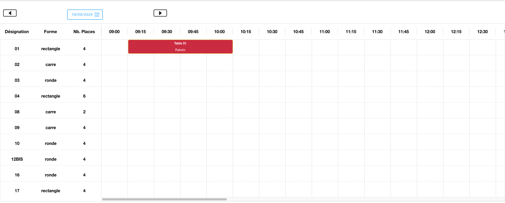

# KESY KELY ADDONS MODULES

## PLAN DE TABlES

La partie **_plan de table_** permet de mettre en place la dispostion des tables selon le restaurant concené

## PLANNING DE RESERVATION

Le **_planning de réservation_** permet de gérer les réservations de tables / chambres via une interface visuelle sos forme de calendrier en timeline (les heures en ligne)

### Utilisation dans un compsant

pour utiliser le composant, il faut effectuer les actions suivantes :
#### dans le composant
``` tsx
import {TimelineCalendarComponent} from "../timeline-calendar/timeline-calendar.component";

@Component({
  imports: [KesyKelyHeaderComponent]
})
```
#### dans la vue :
``` html
  <kesy-timeline-calendar
    [tables]="tableList"
    [options]="options"
    [allEvents]="events"
    (eventCreated)="createEvent($event)"
    (eventUpdated)="updateEvent($event)"
    (eventDeleted)="deleteEvent($event)"
  ></kesy-timeline-calendar>
```

Les variables à passer sont les suivantes :
* **tables** : La liste des tables, sous forme d'objet
``` ts
  {
    idTablePlace: "01",
    nameTable: "01",
    idReservation: 0,
    idFclient: null,
    nbPlace: 4,
    formeTable: "rectangle\r\n",
    nom: null,
    prenom: null,
    tel: null,
    heureDebut: null,
    nomSociete: null,
    typeReservation: "O",
    statueTable: "O",
    emplacements: "A",
    idEmplacement: 1,
    couleur: "#dc3545",
    colorText: "white",
    nomType: "Occupé",
    aCompteResa: "0",
    orderTable: 1,
    events: []
  }
```
* **options** : les options, sous forme d'objet, qui permettent de paramétrer l'affichage
``` ts
{
    columns: ['Désignation', 'Forme', 'Nb. Places'],
    columnsData: ['nameTable', 'formeTable', 'nbPlace'],
    beginHour: '09:00',
    endHour: '21:00',
    step: 15
  }
```

dont voici les détails des options :
- **_columns_** : les en-têtes de la colonne de gauche
- **_columnsData_** : les données de la colonne de gauche, il faut mettre le nom des attributs concernés venant de l'objet d'une table
- **_beginHour_** : heure de débute d'une journée
- **_endHour_** : heure de fin d'une journée
- **_step_** : intervalle de temps, en minute, de planning
* **allEvents** : la liste des évenements


